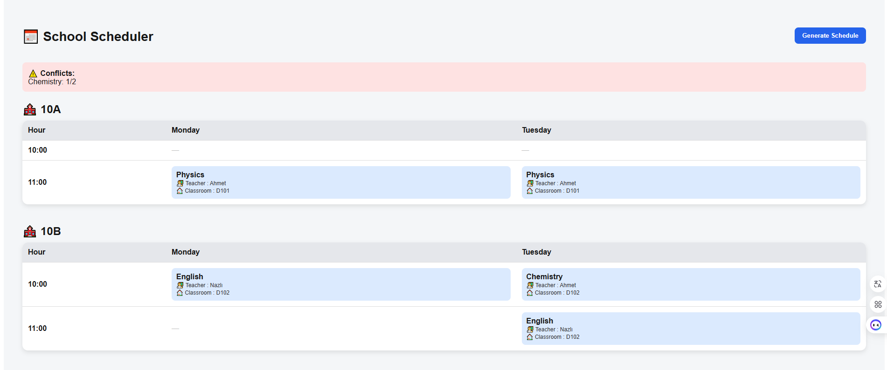

# 📅 School Scheduler

A full-stack web application that automatically generates optimized school timetables while respecting real-world constraints such as teacher availability, classroom conflicts, and weekly lesson requirements.

---

## 🚀 Live Demo

🔗 https://school-scheduler-lac.vercel.app

---

## 📸 Demo



---

## ⚙️ Tech Stack

### Frontend

* Next.js (App Router)
* React
* Axios
* Tailwind CSS (optional)

### Backend

* FastAPI
* SQLAlchemy
* SQLite

### Deployment

* Vercel (Frontend)
* Render (Backend)

---

## 🧠 Core Features

* Automatic timetable generation
* Teacher availability constraints
* Prevention of overlapping lessons
* Classroom conflict handling
* Weekly course hour requirements
* Conflict detection and reporting system

---

## 🧩 Scheduling Logic

The scheduling engine follows a constraint-based approach:

1. Courses are prioritized based on difficulty (limited teacher availability)
2. Each course is assigned to valid time slots
3. Constraints enforced:

   * Teacher must be available
   * Classroom must be available
   * Class group must not have another lesson at the same time
4. If no valid slot is found → conflict is recorded

---

## 📁 Project Structure

```
school-scheduler/
│
├── backend/
│   ├── app/
│   │   ├── api/routes/
│   │   ├── models/
│   │   ├── schemas/
│   │   ├── services/
│   │   ├── scheduler/
│   │   └── db/
│
├── frontend/
│   ├── app/
│   ├── public/
│   └── package.json
│
└── README.md
```

---

## ⚡ Local Setup

### Backend

```bash
cd backend
pip install -r requirements.txt
uvicorn app.main:app --reload
```

### Frontend

```bash
cd frontend
npm install
npm run dev
```

---

## 🔧 Environment Variables

Create a `.env` file inside the frontend directory:

```env
NEXT_PUBLIC_API_URL=http://localhost:8000
```

For production:

```env
NEXT_PUBLIC_API_URL=https://your-backend.onrender.com
```

---

## ⚠️ Important Notes

* Render free tier may cause cold start delays (first request can take 10–20 seconds)
* SQLite is used for simplicity and is not recommended for production-scale applications

---

## 📌 Future Improvements

* Drag & drop timetable interface
* Export timetable to PDF / Excel
* Advanced scheduling algorithm (optimization-based)
* PostgreSQL integration
* Authentication & user roles

---

## 👨‍💻 Author

Emre Doğan
